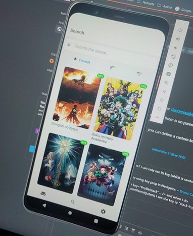
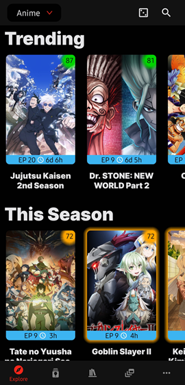
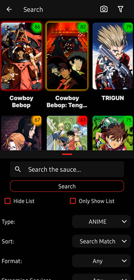
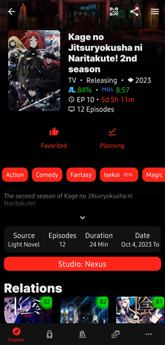

# About

Goraku is a mobile app that lets you explore anime, manga, and novels. Whether you are already an otaku or someone just starting, you'll find something new.

## Goal

Goraku's goal is to make it easier to find new content that has as much information as possible. 

## The Dark Past of Goraku

Initially, Goraku started as one of my beginner projects a couple years back. Compared to then and now, the app has evolved a whole lot.

### Version 1
One of my first projects. I'm glad I've learned a lot since then. Here are a few screenshots of the first version of Goraku:

| Media Page                      | Search page                       |
| ------------------------------- | --------------------------------- |
|  |  |

### Version 2
This version actually had a release on github! It was a huge improvement from the first version, but still lacked in all areas.  

I often got lost in my own code because it wasn't organized at all, so I decided to rewrite the app from scratch - but with an organized codebase.

Since the new Goraku has been released, I archived this version. You can still look at the code [here]() and I don't recommemend downloading any of the releases. 

| Explore Page                        | Search page                         | Info page                       |
| ----------------------------------- | ----------------------------------- | ------------------------------- |
|  |  |  |