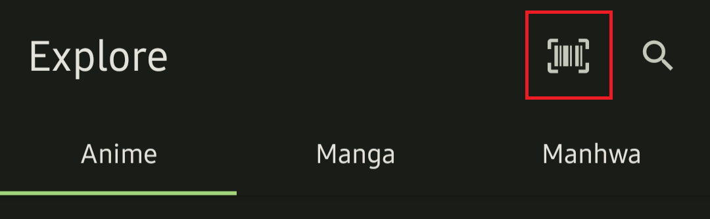
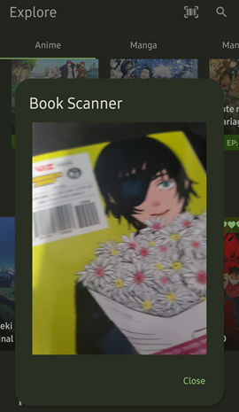
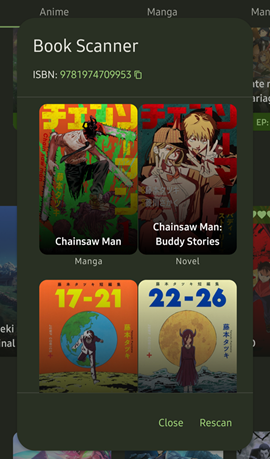

# Barcode Scanner

Scan the barcode of a manga or novel to quickly search for it on Anilist.

This is great for looking up manga or novels at a bookstore or for adding your existing collection to your Anilist list.

## How to Use

1. On the Explore tab, press the barcode icon at the top right - next to the search icon.  
2. Now scan the barcode on the back of the book. This scans for the ISBN number.  
3. Select the correct series from the list of results.  