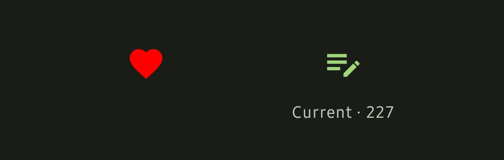

# Media Info

## Titles

View the English, romaji, and native title of a series. 

::: tip 📌 Copy to Clipboard
You can also copy the title to clipboard by long pressing on it.
:::

::: warning ⚠️ English Title
The English title is not always available. This often occurs with manga titles.
:::

## Tags
Easily view the genres and tags of a series.

:::tip 📌 Tip #1
Press on a tag to learn more about it.
:::

:::tip 📌 Tip #2
Some tags are marked as a spoiler or NSFW. Simply tap on the tag to reveal the spoiler.
:::

## Scores
The Anilist mean/average score and MAL score are displayed for every series.

::: warning ⚠️ MAL Score
The MAL score is not always available. This occurs when the MAL score is missing or the MAL ID has not been recorded in the Anilist database.
:::

## User Actions
You can add a series to your list and favorites. Once added to your list, you can then edit the entry.

| Add to Favorites / List             | Edit List Entry                 |
| ----------------------------------- | ------------------------------- |
|  |  |

## Quick Actions
Quickly access the series characters, staff, music (if applicable), and news.

## Edit / Share

If you find that some Anilist data is missing and want to contribute, you can press the edit icon at the top right.

You can also share the anilist link with friends by pressing the share icon.

::: info ℹ️ Planned Feature
We are currently working on allowing users to open the app when opening Anilist links.
:::

## Media Details / Manga Updates
View all the details about a series such as the source, episodes/chapters/volumes, origin, and more.

[What's Manga Updates?](../../mangaupdates/)

| Details / Manga Updates           | Details                               |
| --------------------------------- | ------------------------------------- |
|  |  |

## Characters / Staff
Find all the documented characters and staff of a series.

::: tip 📌 Tip
A right arrow will appear on the top right if there are more characters/staff than in the list. Pressing this will take you to a full list.  
You can also use the [quick actions](#quick-actions) to access the full list.
:::

| Characters                      | Staff                              |
| ------------------------------- | ---------------------------------- |
|  |  |

## Relations / Recommendations
View the related series such as source, prequals, sequels, and spinoffs. You can also view the recommendations for a series.

## Trailer
If an anime trailer is available, you can watch it here!

## Links
Browse the official website, X (Twitter), and other links of a series.

