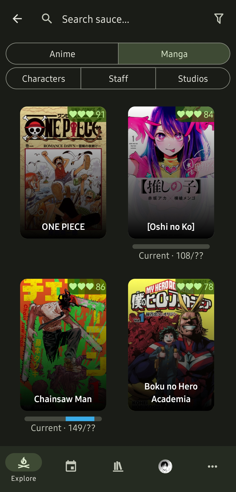
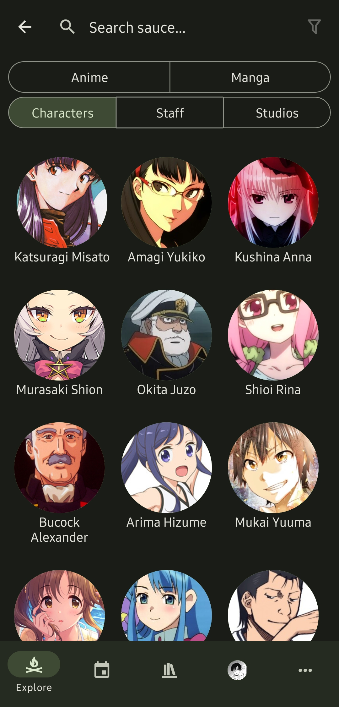

# Search

| Media Search                      | Character/Staff Search                  | Studio Search                        |
| --------------------------------- | --------------------------------------- | ------------------------------------ |
|  |  |  |

## Filters

## Image Search
Image search is available for anime and characters.

### Anime
:::tip 📌 Tip
Using anime screenshots will yield better results.
:::

### Characters
:::warning ⚠️ Wait Time
This feature uses a queuing system. It may take a few minutes to get a response.
:::

Uploading any image of a character will work (like fan art). The less popular a character is the less likely they will be recognized. New characters after ~2022 will not be recognized. 

Read more about the limitations here: [WD 1.4 MOAT Tagger v2](https://huggingface.co/SmilingWolf/wd-v1-4-moat-tagger-v2)

