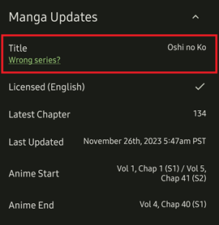
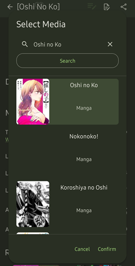

# Manga Updates

Curious about how many chapters a manga / novel has been translated? What chapter the anime started and ended on? Is English licensed? 

With Manga Updates, you can find all of this information.

## How to Use
::: info ℹ️ Notice
This process is automated and will usually find the correct series. In the event that it doesn't, you can manually search for the series by following these instructions.
:::

1. Open a series you want to know more about
2. Scroll down to the *Manga Updates* section
3. Press the title  
4. Find and select the correct series  

This will save the series selected, so you won't have to set it again.